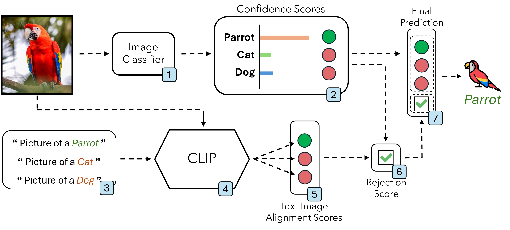
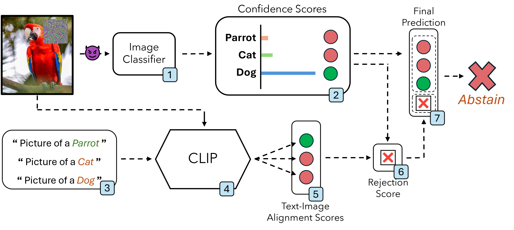

# Multi-Shield: Robust Image Classification with Multi-Modal Large Language Models

[](https://opensource.org/licenses/MIT)
[](https://www.python.org/downloads/)
[](https://pytorch.org/)

Official implementation of **Multi-Shield**, a novel defense mechanism that leverages multi-modal data (visual and textual) to identify and reject adversarial examples.

📄 **Paper**: [Multi-Shield: Robust Image Classification with Multi-Modal Large Language Models](https://www.sciencedirect.com/science/article/pii/S0167865525001618) (Pattern Recognition Letters, 2025)

📓 **Quick Start**: Try the [interactive Jupyter notebook](quick_start.ipynb) for a hands-on demo with visualizations!

---

## Overview

Multi-Shield is a defensive mechanism that combines a DNN image classifier with a CLIP vision-language model to detect adversarial examples. The key insight is that adversarial perturbations optimized for the DNN often fail to also fool the multi-modal CLIP model.

### How It Works

Multi-Shield operates in three distinct phases:

1. **Unimodal Classification**: The DNN classifier processes the input image and generates class predictions
2. **Multi-Modal Alignment**: CLIP computes alignment scores between the image and textual class descriptions
3. **Decision**: If both models agree, output the prediction; if they disagree, reject the sample

### Clean vs Adversarial Scenario

| Clean Scenario | Adversarial Scenario |
|:---:|:---:|
|  |  |
| DNN and CLIP agree → Accept prediction | DNN and CLIP disagree → Reject sample |

---

## Installation

### Prerequisites

- Python 3.11+
- CUDA-capable GPU (recommended)
- Conda package manager

### Setup

1. Clone the repository:

```bash
git clone https://github.com/your-username/multishield.git
cd multishield
```

1. Create and activate the conda environment:

```bash
conda env create -f env.yml
conda activate multishield
```

---

## Quick Start

### Running an Experiment

Run a Multi-Shield evaluation on CIFAR-10:

```bash
python main.py --config=configs/config_cifar10.json --device=cuda --seed=1233
```

This will:

1. Load a robust DNN classifier from RobustBench
2. Configure a CLIP model for zero-shot classification
3. Run non-adaptive and adaptive adversarial attacks
4. Evaluate Multi-Shield's defense performance
5. Save results to `results/`

### Configuration

Experiments are configured via JSON files. Example for CIFAR-10:

```json
{
    "seed": 1233,
    "experiments": [
        {
            "clip_model_id": "tangake_finetuned",
            "dataset": "cifar10",
            "model_name": "carmon2019",
            "n_samples": 100,
            "batch_size": 32,
            "attack_parameters": {
                "epsilon": 8,
                "verbose": false
            }
        }
    ]
}
```

### Quick Test (Small Dataset)

For a quick test run, use a small number of samples:

```bash
# Edit config to use fewer samples for testing
python main.py --config=configs/config_cifar10.json --device=cuda --seed=1233
```

### ImageNet Dataset Setup

For ImageNet experiments, the dataset must be located at `/data/datasets/imagenet/` with the following structure:

```
/data/datasets/imagenet/
├── train/
│   ├── n01440764/
│   ├── n01443537/
│   └── ...
└── val/
    ├── n01440764/
    ├── n01443537/
    └── ...
```

If you want to use a different path, modify `IMAGENET_TRAINING_PATH` in `ingredients/dataset.py`.

---

## Code Structure

```
multishield/
├── main.py                      # Main experiment script
├── env.yml                      # Conda environment
├── LICENSE                      # MIT License
│
├── configs/                     # Experiment configurations
│   └── config_cifar10.json
│
├── models/                      # Model implementations
│   ├── MultiShield.py           # Core Multi-Shield defense
│   └── CLIP.py                  # CLIP model wrapper
│
├── ingredients/                 # Utilities
│   ├── dataset.py               # Dataset loading
│   ├── models.py                # Model loading (RobustBench)
│   └── utilities.py             # Helper functions
├── attacks/                     # Attack implementations
└── assets/                      # Images and diagrams
```

---

## Models

### DNN Classifiers

Multi-Shield uses robust classifiers from [RobustBench](https://robustbench.github.io/). Models are automatically downloaded on first use:

- **CIFAR-10**: `carmon2019`, `gowal2021`, `chen2020`, `xu2023`, `addepalli2022`
- **ImageNet**: `liu2023` (and others via RobustBench)

### CLIP Models

Supported CLIP configurations:

- `tangake_finetuned`: Fine-tuned CLIP for CIFAR-10 (HuggingFace)
- `clipa_ViT_L`: Large CLIP-A model for ImageNet (OpenCLIP)

### Custom Models for Other Datasets

The codebase includes placeholder configurations for additional datasets (Caltech-101, STL-10, Food-101, Oxford-IIIT Pets) using ResNet50 and WideResNet50 architectures. To use these:

1. Train your models using standard PyTorch training procedures
2. Save the model weights to `pretrained_models/custom/`
3. Update the paths in `ingredients/models.py` if needed

Example model configurations are provided in `ingredients/models.py` for reference.

---

## Citation

If you use Multi-Shield in your research, please cite our paper:

```bibtex
@article{villani2025robust,
  title={Robust image classification with multi-modal large language models},
  author={Villani, Francesco and Maljkovic, Igor and Lazzaro, Dario and Sotgiu, Angelo and Cin{\`a}, Antonio Emanuele and Roli, Fabio},
  journal={Pattern Recognition Letters},
  year={2025},
  publisher={Elsevier}
}
```

---

## Acknowledgements

We thank the following projects that made this work possible:

- [RobustBench](https://github.com/RobustBench/robustbench) - Robust model zoo and evaluation
- [AutoAttack](https://github.com/fra31/auto-attack) - Adversarial attack implementation
- [OpenCLIP](https://github.com/mlfoundations/open_clip) - Open-source CLIP implementation
- [HuggingFace Transformers](https://github.com/huggingface/transformers) - CLIP model hosting

---

## License

This project is licensed under the MIT License - see the [LICENSE](LICENSE) file for details.
